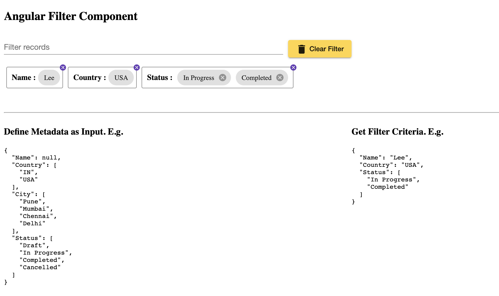
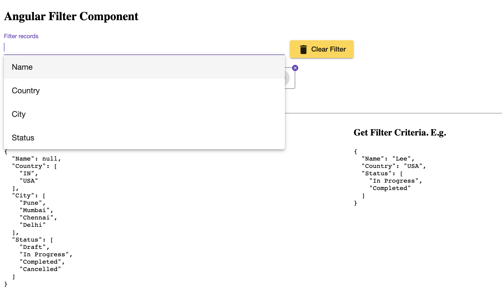
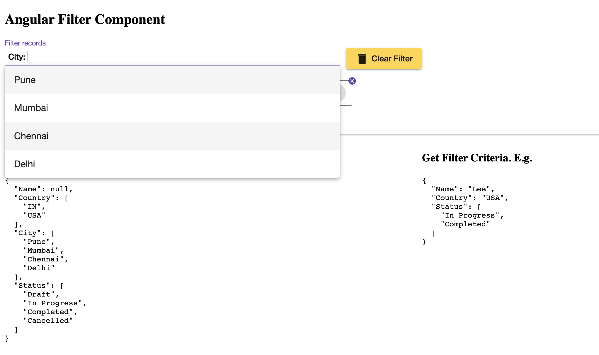
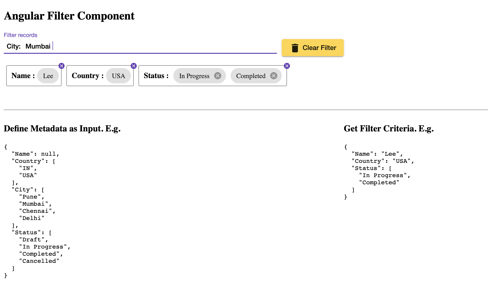
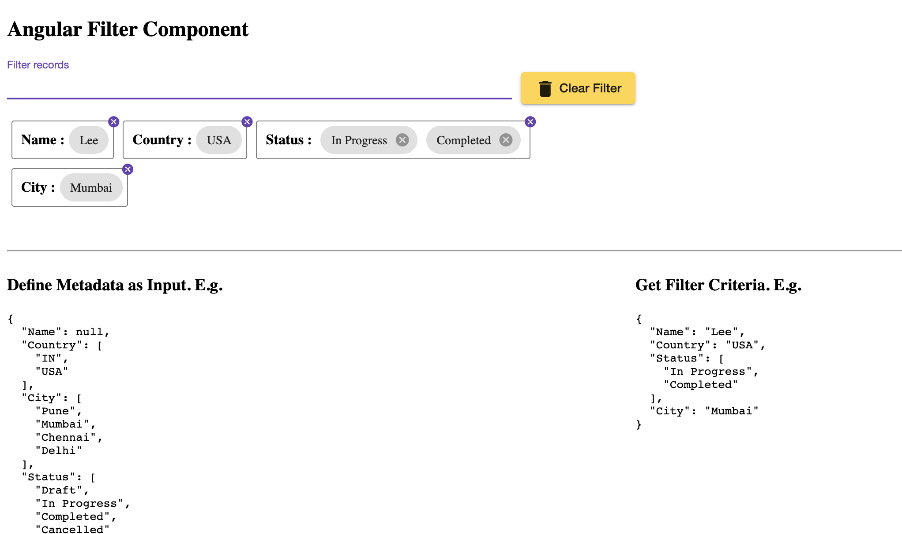

# Angular Filter Component

A component that would allow user to form filter criteria based predefined criteria metadata.

Try demo here: https://murlidharvarma.github.io/ngFilter/

Use tag like below

```
<app-filter 
    [metadata]="filterMetadata" 
    (selectedFilters)="filterCriteria($event)">
</app-filter>
```
## Input
Pass ```metadata``` as Input. The key of metadata forms the Criteria Key and the corresponding value if
- Null will indicate user input text
- Array will indicate user need to be presented with predefined options

```
{
  "Name": null,
  "Country": ["India", "USA"],
  "City": ["Pune", "Mumbai", "Chennai", "Delhi"],
  "Status": ["Draft", "In Progress", "Completed","Cancelled"]
}
```

In above example of metadata ```Name```, ```Country```, ```City``` and  ```Status``` forms the Criteria Key

```Name``` having value null will allow user to input free text

```Country```, ```City``` and  ```Status``` being array, user will be presented with Array values as options. However user can choose to input free text too. The options are searchable.

## Output

Generate output would look like this for above example based on user selection
```
{
  "Name": "Lee",
  "Country": "USA",
  "Status": [
    "In Progress",
    "Completed"
  ],
  "City": "Mumbai"
}
```

## Screenshots





